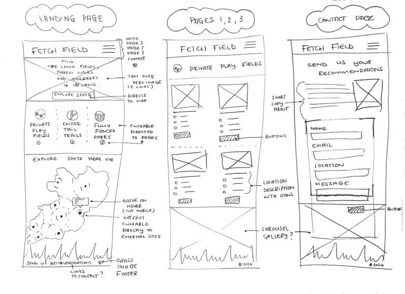

# Fetch Field

The Fetch Field website was created to assist dog owners in finding the perfect location, within Ireland, depending on their furry friend's needs and potential reactive nature to their surroundings. It targets dog owners who are looking for a private field to hire, a secluded forest walk to take in the natural beauty Ireland offers, or maybe a public park with like-minded dog owners for play dates. The site is responsive for all screen sizes.

## Features 

### Existing Features

- __Header Navigation bar__

  - The site logo and emblem sets the main colour theme: teal, liquorice and white.
  - Featured on all three pages, the full responsive navigation bar includes links to the Logo, Home page, Explore and Contact page and is identical on each page to allow for easy navigation.
  - Mobile screen navigation is styled into a navbar dropdown for optimal functionality on smaller screens.

- __Landing page hero image__

  - This section introduces the user to Fetch Field with a colourful and playful photograph of a dog in a field with text overlay. 
  - Button below text allows user to view all walk locations and redirects them straight to the Explore page. 

- __Explore section__

  - This panel consists of 3 various types of locations, depending on the users need for their furry friend. The user can select the option and access the specific locations directly on Explore page. 

- __Map section__

  - The gif animated map grabs the users attention to various locations the site has suggested spots to.
  - Button below map allows user to contribute and send their suggested location, redirecting them to contact page.

- __The Footer__ 

  - The footer section includes a link to Fetch Field Instagram account. The link will open to a new tab to allow easy navigation for the user. 

- __Explore__

  - This page consists of 3 sections; Private Play Fields, Coillte Tail Trails and Fully Fenced Parks. Each section is divided with a header panel which informs the user of what the locations are based on, and following the direction of these the user will determine which to explore their options within.
  - Each location item is presented with a relevant image to the field, trail or park. The name and location is visible, followed by a few brief bullet points to advise the user what to expect from the suggested location with a button that follows. If the user decides to find out more about the location, they will be redirected to an external site.

- __Contact Form Page__

  - This page will allow the user to send suggested walk locations to share with the Fetch Field community.
  - The user will be asked to submit their full name and email address and location.
  - The user will be able to select the type of walk they are suggesting, with Private Field, Forest or Fenced Park options.
  - The form includes a message box for users to give more details about the location they are suggesting to the community before submitting form.

### UX/UI Wireframing

- The site was developed with the Mobile-first method.
- Main colour theme hex for teal (#48C3C5) and liquorice (#202020).
- Wireframe drawn up pre-development to assist with structure of elements on each page, panels are based on mobile view. As development commenced, elements on pages were adjusted for the best user experience.

### Future Features to Implement

-  Link formdump.html for user to view successful form sent, with message thanking them for their contribution. Keeping the user within the site structure to further navigate and explore if wanted.

- Add an interactive map with location hotspots on home page, allowing user to easily navigate to prefered location spots from visual map. This feature will have a hover function on the locator icon, this then activates a tooltip bubble with information about the location and when clicked directs the user to a relevant external site.

-  Build a carousel gallery for Instagram posts of followers and their furry friends at the various Fetch Field suggested locations around Ireland. Allowing the user to feel part of building a community and the benefits of sharing great locations for potential dog owners to enjoy.

## Testing 

### Accessibility

- Ran the pages through Lighthouse, performance with initial load passed, and the site is accessible.

- Testing color contrast and its affect on different visual impairments via [WhoCanUse.com](https://www.whocanuse.com/)

-   Tested and confirmed that the page works in different browsers; Chrome, Safari and Firefox.
-   Tested and confirmed that all internal links are working and redirecting the user between the pages.
-   Tested that all external links are woking and opening in a separate tab.
-   Tested and confirmed that the contact form works, all fields are required, the radio buttons are required (one of them), the email field only accepts email address, and the submit button link works:

### Validator Testing 

- HTML
  - Duplicate 'id' attributes used on explore.html when passing through validator, #explore-item-section1, #explore-item-section2 and #explore-item-cta. All duplicate 'id' changed to class attribute instead.
  - After fixing above attributes, no errors found when running the code through the [W3C HTML Validator](https://validator.w3.org/)

- CSS
  - Duplicate 'id' attributes used on explore.html when passing through validator, #explore-item-section1, #explore-item-section2 and #explore-item-cta. All duplicate 'id' changed to class attribute instead.
  - After fixing above attributes, no errors found when running the code through the [W3C CSS Validator](https://jigsaw.w3.org/css-validator/)

### Bugs Encountered

- Contact dumpform.html
  - Created a dumpform.html page to link to a successful form submition, but form wouldn't link on deployed site without javascript added. Opted to link an external form dump site (https://formdump.codeinstitute.net) for functionality and to pass validation tests.

- Contast error on footer link
  - A contrast errors was returned when passing through the official [WAVE Web Accessibility Evaluation Tools](https://wave.webaim.org/)
    Link was dropping down below footer background image, link rendering against background instead of image grass panel. To fix bug the grass footer image height was increased to create more space in footer section, allowing link to be pushed up in styles for various screen sizes and added transparent background.

### Unfixed Bugs

-   No unfixed bugs, [WAVE Web Accessibility Evaluation Tools] returned with no errors.

## Deployment

### Version Control
-   The site was created using Gitpod editor and pushed to Github to the remote repository 'fetchfield.ie'.
-   Git commands were used throughout the development to push the code to the remote repository. The following git commands were used:
    -   git add . - to add the files to the staging area before being committed.
    -   git commit -m "commit message" - to commit changes to the local repository queue that are ready for the final step.
    -   git push - to push all committed code to the remote repository on Github.

### Deployment to Github pages
-   The site was deployed to Github pages as follows:
    -   In the Github repository, navigate to Settings tab
    -   From the source section drop-down menu, select the Master branch and Save
    -   Once the Master branch was selected, the page provided the link to the website
- The site was deployed to GitHub pages, the live link can be found here: https://schoemanclaudia.github.io/fetchfield.ie/

### Cloning of the Repository Code locally
-   Go to the Github repository that you want to clone
-   Click on the Code button located above all the project files
-   Click on HTTPS and copy the repository link
-   Open the IDE of your choice and and paste the copied git url into the IDE terminal
-   The project is now created as a local clone

## Credits 

- Slack channel peer-code-review participants for assisting with bug fix.
- My mentor for the support and knowledge shared.

### Content 

-   The icons throughout site were taken from [Font Awesome](https://fontawesome.com/)   
-   The favicon and logo icon, Ireland map and footer details was taken from [Adobe Stock](https://stock.adobe.com/). Creative Cloud software was used for the changes to elements to suit site branding.
-   The Love Running project walkthrough code assisted with certain navigation and flex functionalities.

### Media

- All images throughout site was taken from [Pexels](https://www.pexels.com/)
