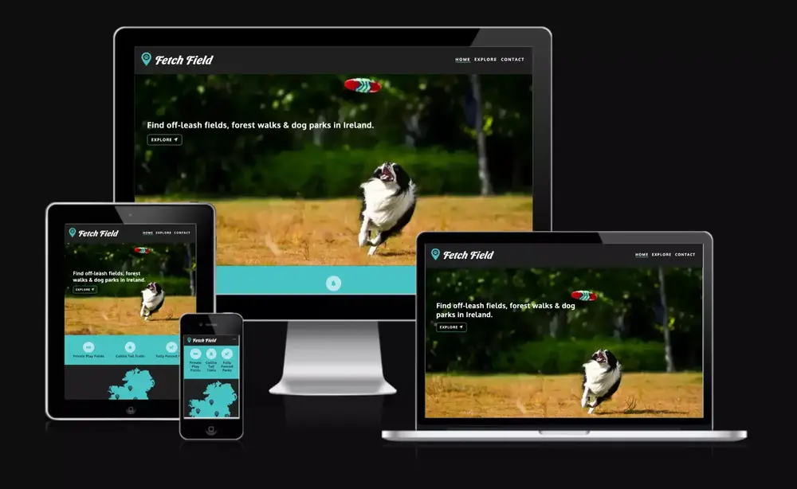
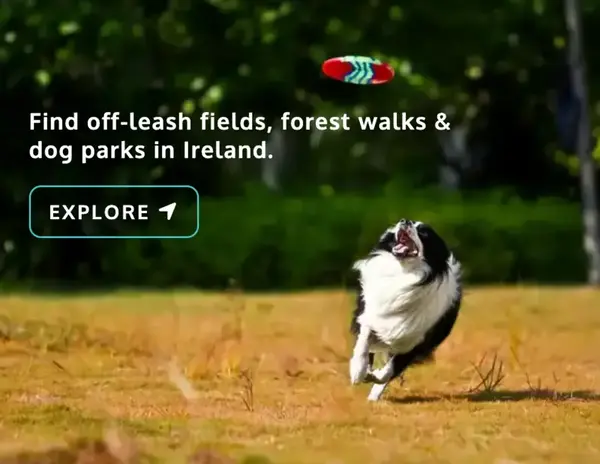

# Fetch Field

The fetch Field website was created to assist dog owners in finding the perfect location, within Ireland, depending on their furry friends needs and potential reactive nature to their surroundings. It targets dog owners that are looking for a private fields to hire, a secluded forest walk to take in the natural beauty Ireland offers, or maybe a public park with like minded dog owners for play dates.

Users of this website will be able to find information about me as a coach, the tools and strategies for Nutrition and Training, how they can benefit from that and what results they can expect. There is also a contact form to easily get the first point of contact. The site is responsive for all screen sizes.

## Features 

### Existing Features

- __Header Navigation bar__

  - The Company logo and emblem sets the main colour theme: teal, liquorice and white.
  - Featured on all three pages, the full responsive navigation bar includes links to the Logo, Home page, Explore and Contact page and is identical in each page to allow for easy navigation.
  - Mobile screen navigation is styled into a navbar dropdown for optimal functionality on smaller screens.

- __Landing page hero image__

  - This section introduces the user to Fetch Field with a colourful and playful photograph of a dog in a field with text overlay. 
  - Button below text allows user to view all walk locations and redirects them straight to the Explore page. 

- __Explore section__

  - This panel consists of 3 various types of locations, depending on the users need for their furry friend. The user can select the option and access the specific locations directly on Explore page. 

- __Map section__

  - The gif animated map grabs the users attention to various locations the site has sugegsted spots to.
  - Button below map allows user to contribute and send their suggested location, redirecting them to contact page.

- __The Footer__ 

  - The footer section includes a link to Fetch Field Instagram account. The link will open to a new tab to allow easy navigation for the user. 

- __Explore__

  - Section details here

- __Contact Form Page__

  - This page will allow the user to send suggested walk locations to share with the Fetch Field community.
  - The user will be asked to submit their full name and email address and location.
  - The user will be able to select the type of walk they are suggesting, with Private Field, Forest or Fenced Park options.
  - The form includes a message box for users to give more details about the location they are suggesting to the community before submitting form.

### UX/UI Wireframing

- Main colour theme hex for teal (#48C3C5) and liquorice (#202020)
- Wireframe drawn up pre development to assist with structure of elements on each page, panels are based on mobile view. As development commenced, elements on pages were adjusted for best user experience.

### Future Features to Implement

- Discuss plans for additional features to be implemented in the future.

## Testing 

### Accessibility

- Lighthouse

- [WhoCanUSe.com](https://www.whocanuse.com/)

### Validator Testing 

- HTML
  - Duplicate 'id' attributes used on explore.html when passing through validator, #explore-item-section1, #explore-item-section2 and #explore-item-cta. All duplicate 'id' changed to class attribute instead.

- CSS
  - Duplicate 'id' attributes used on explore.html when passing through validator, #explore-item-section1, #explore-item-section2 and #explore-item-cta. All duplicate 'id' changed to class attribute instead.

### Bugs Encountered

- Contact dumpform.html
  - Created a dumpform.html page to link to successful form submit, but form wouldn't link on deployed site without javascript added. Opted to link an external form dump site (https://formdump.codeinstitute.net) for functionality and to pass validation tests.

- Contast error on footer link
  - A contrast errors was returned when passing through the official [WAVE Web Accessibility Evaluation Tools](https://wave.webaim.org/)
    Link was dropping down below footer background image, link rendering against background instead of image grass panel. To fix bug the grass footer image height was increased to create more space in footer section, allowing link to be pushed up in styles for various screen sizes.

### Unfixed Bugs

Paragraph section 

## Deployment

- The site was deployed to GitHub pages, the live link can be found here:
 - https://schoemanclaudia.github.io/fetchfield.ie/

## Credits 

- Details here

### Content 

- Section details here

### Media

- Section details here
